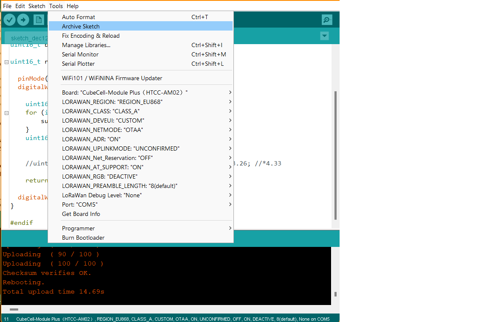

# GPS_LORA_TRACKER

## Main directory structure

    .
    ├── AM02_GPS_LORA_V01          # Arduino code to send geo coordintates via LoRa to [TTN](https://console.cloud.thethings.network/)
    ├── Hardware                   # PDF files of electronics
    ├── Pics                       # Pictures referenced in this file
    ├── TESTS                      # Arduino code to communicate with GnssToolKit3 software in pass-through mode
    ├── GnsssToolKit3.zip          # Software to communicate with GPS unit, useful for troubleshooting and testing
    └── README.md                  # this file

## LoRaWAN communication of geographical coordinates
### Setup

Install the Heltec board on the Arduino IDE according to the "Board manager" guidelines available here:
https://docs.heltec.org/en/node/cubecell/quick_start.html

Quick link to the .json file:
https://github.com/HelTecAutomation/CubeCell-Arduino/releases/download/V1.4.0/package_CubeCell_index.json

Once installed, you'll be ready to properly compile and upload code for this PSoC.

## Establish serial communication

Use the USB serial bridge (CP2102) and the 6 pin adapter to program the board. Pin order from left to right is:

5V | TX | RX | RTS | DTR | GND

TX and RX are the transmission lines, RTS and DTR are used to automatically set the lora chip AM02 in boot mode, therefore ready to receive new firmware.

### Interactive bill of material (BOM)

Download and open in the browser the file in the "Hardware" folder, you will be prompted with and interactive PCB showing nets and components. Move around the mouse and click on any net to highlight it and understan the routing.

##ARDUINO

The sketch [AM02_GPS_LORA_V01.ino](AM02_GPS_LORA_V01/AM02_GPS_LORA_V01.ino) allows the prototype to transmit coordinates via LoRa to the gateway.
When compiling, please use the following settings:

### AM02_GPS_LORA_V01 directory files

    .
    ├── AM02_GPS_LORA_V01.ino            # this is the main sketch
    ├── readbattery.h                    # header file with functions to read battery voltage
    └── TTN.h                            # header file containing all the TTN objects (keys, duty cycle etc)

The first few lines of the sketch file are meant to load dependences:  
https://github.com/piecol/GPS_LORA_TRACKER/blob/8f8fe18ed2a30a6c96698fc1f8999d2fb00c988e/AM02_GPS_LORA_V01/AM02_GPS_LORA_V01.ino#L12-L16

Please pay attention to: 
https://github.com/piecol/GPS_LORA_TRACKER/blob/8f8fe18ed2a30a6c96698fc1f8999d2fb00c988e/AM02_GPS_LORA_V01/AM02_GPS_LORA_V01.ino#L7-L9

### GNSS Toolkit: a tool to test the Air530z module

By uploading the Arduino sketch [GPS_GNSS_Toolkit_UART.ino](TESTS/GPS_GNSS_Toolkit_UART.ino), you'll be able to communicate with the GPS unit via the GNSS Toolkit3 software. The software is provided as a .zip file in this repository. Please be aware that the original language is chinese, but can the GUI can be viewed in english.

